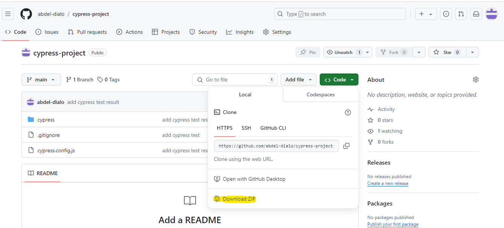

# Cypress - Automation Testing

  Here's a README that explains how to run the project locally And how to view the execution report

## Prerequite

- Make sure you have [Node.js](https://docs.cypress.io/guides/getting-started/installing-cypress#Installing-Nodejs) installed and that you have already run [npm init](https://docs.npmjs.com/cli/v10/commands/npm-init) or have a **node_modules** folder or **package.json** file in the root of your project to ensure Cypress is installed in the correct directory.

- Have a Bash editor
- Install git

## Setup
1 - Download the project

- Download the project zip file
  
- Extract the project.
- Navigate to the project directory.
- Type the following commands


    ```
      npm init
      npm install cypress --save-dev
      npm install mochawesome mochawesome-merge mochawesome-report-generator --save-dev

     ```


2 - With Git
- Create a directory
- Go to the directory
- Type the following commands:

     ```
     git clone https://github.com/abdel-dialo/cypress-project.git
     cd cypress-project
     npm init
     npm install cypress --save-dev
     npm install mochawesome mochawesome-merge mochawesome-report-generator --save-dev

     ```
 
 ##  Run Test
Go to the project directory
Type the following command:


```
     npx cypress run
```
## Visualiser le rapport
   To view the results, go to the directory _Cypress->results_.
   Open the file _mochawesome_xxx.html_ in a web browser


